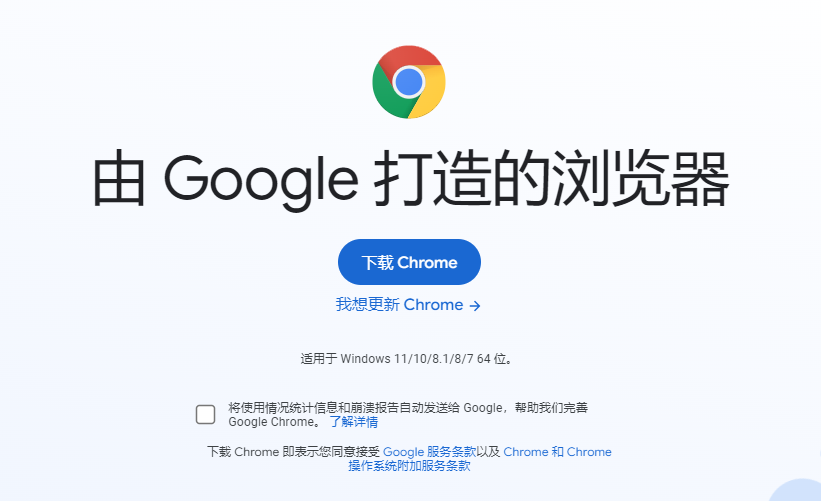
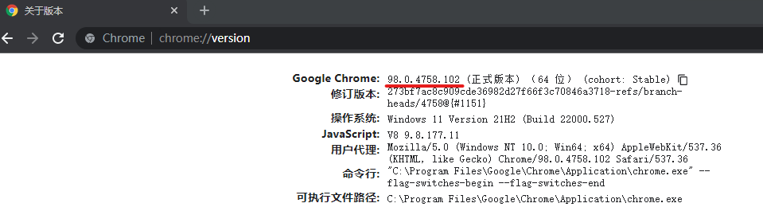
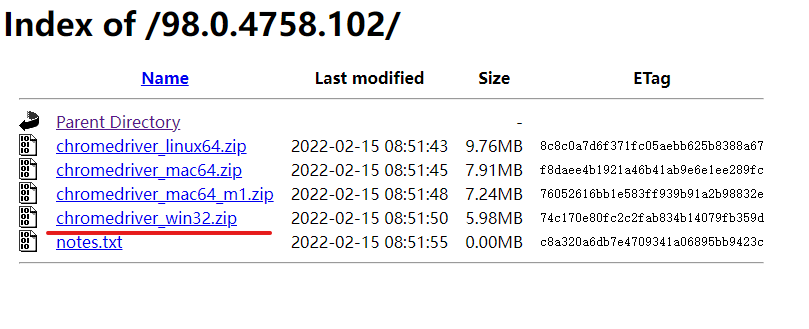
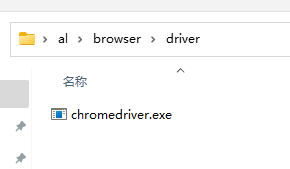
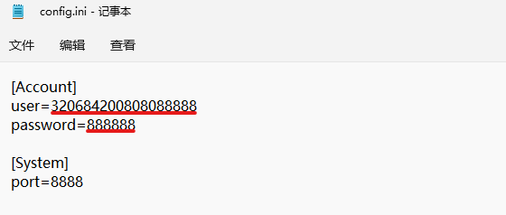

# AL——Auto E-Learning
## 使用说明
#### 一、安装谷歌浏览器
1. 访问[谷歌浏览器官方网站](https://www.google.cn/chrome/index.html)，或者在浏览器地址栏输入:
    ```
    https://www.google.cn/chrome/index.html
    ```
2. 点击“下载Chrome”下载并安装Chrome浏览器
    >
#### 二、 下载驱动
1. 打开Chrome(谷歌浏览器)，在地址栏输入：
   `chrome://version`

    查看Chrome版本号，如下图红线处，我的chrome版本号为：98.0.4758.102
    >
2. 打开[Chrome 驱动下载地址](http://chromedriver.storage.googleapis.com/index.html)，或者在浏览器地址栏输入：
    ```
    http://chromedriver.storage.googleapis.com/index.html
    ```
    根据上一步中的浏览器版本号下载对应的驱动程序。如下图，我浏览器的版本是：98.0.4758.102，我使用的是windows系统，于是我就下载“chromedriver_win32.zip”
    >
3. 解压下载的压缩包，会得到一个“chromedriver.exe”的驱动文件，将这个附件移动到AL工具包目录/browser/driver目录下

    >

#### 三、配置文件
1. 用记事本打开AL工具包目录下的“config.ini”文件，输入你自己云端学习的账号密码，最下面的“port”配置一般情况下不用修改。
    >

#### 四、运行
    运行AL工具包中的“AutoLearning.exe”